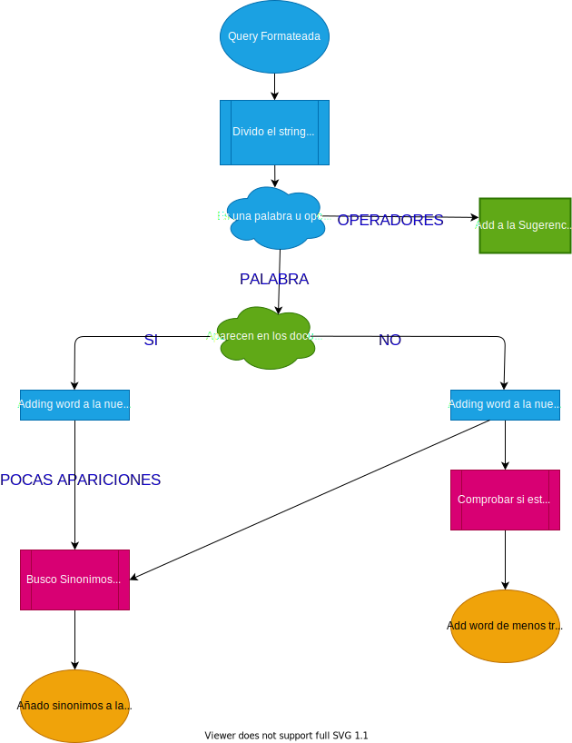

# Moogle!
##### Documentación del Codigo Solución


> Proyecto de Programación I. Facultad de Matemática y Computación. Universidad de La Habana. Curso 2021.
>
>Dev: Carlos Manuel Gonzalez Peña C11

Moogle! es un buscador desarrollado con .Net Core 6.0 usando Blazor como Framework de interfás gráfica.
El obetivo de este buscador es poder realizar consultas de tipo texto en un conjunto de documentos.
Para realizar las consultas se usa el Modelo de Espacio Vectorial (Vectorial Space Model), organizando y mostrando los resultados inteligentemente.

La aplicacion esta dividida en dos grandes Componentes:

    - `MoogleServer:` es un servidor web que renderiza la interfaz gráfica y sirve los resultados.
    - `MoogleEngine:` contiene toda la logica que usa la aplicación para realizar las busquedas.
  
Antes de entrar en detalles del funcionamiento de la aplicación, veamos una pequeña introducción de como funciona el proyecto y que tecnicas uso para realizar las busquedas.
    La aplicacion usa <strong>el modelo vectorial</strong> para calcular las semejanzas entre los documentos. Al usuario realizar un busqueda, la aplicacion buscara todos los documentos que esten relacionados con la consulta, o sea, no necesariamente debe de aparecer la palabra en el documento, con encontrar palabras que tengan un significado parecido o pertenezcan a la misma familia de palabras sera suficiente para mostrar tambien esos documentos. 
    El realizar la consulta el usuario dispondrá de un conjuto de operadores (explicados en la orientacion del proyecto) para poder realizar consultas mas personalizadas y poderosas. 
    Durante el proyecto hago uso de un metodo llamado <strong>Algoritmo de Porter</strong>, que no es mas que un conjunto de reglas del idioma español para poder llevar todas las palarbas a una raiz comun y asi poder identificar a que familia pertenece, ayudando asi a encontrar resultados de la consulta del usuario. Tambien hago uso de un diccionario de sinonimos en formato JSON para poder devolver la mayor cantidad de resultados posibles en cada busqueda realizada por el usuario. 

## Implentación MoogleEngine

Este componente cuenta con 10 clases que contienten los algoritmos necesarios para realizar las consultas:

     -`SearchItems:` Contiene la informacion de cada documento que se quiere mostrar en los resultados de una búsqueda.
     -`SearchResult:` Contiene una lista de `SearchItems` y una sugerencia de consulta para mostrar en los resultados .
     -`Moogle:` En ella aparece un metodo Query, la cual tendra todo el proceso(apoyandoce de las demas clases) desde que se recibe la query hasta que se mandan los resultados para renderizarlos.
     -`SaveData:` Es una clase en la que se guardaran todos los datos extraidos de los docuentos, o los datos que son necesarios para realizar las consultas.
     -`WordInfo:` Es una clase que guarda la informacion de cada palabra del documento.
     -`FilesMethods:` Conjunto de metodos relacionados con el procesamiento de los documentos.
     -`AuxiliarMethods:` Conjunto de metodos auxiliares que tienen un uso global.
     -`WorkingOperators:` Conjunto de Metodos para el procesamiento de los operadores que aparezcan en la consulta del usuario.
     -`WorkingSynonyms:` Clase dedicada al procesamiento de una base de datos de sinonimos de las palabras en español.
     -`PorterAlogrithm:` Algoritmo para calcular las raices de las palarbas del español.

#### Procesamiento de Palabras del Corpus
Al arrancar el servidor se ejecuta el metodo `DataProcessing` el cual se encarga de leer todos los documentos y crea un diccionario `PosInDocs` donde a cada documento le corresponde otro diccionario con el conjunto de palabras de ese documento en sus respectivas raices y por cada palabra una instancia de la clase `WordInfo` que contiene las apariciones de la palabra en el documento y el score de la misma. Cabe destacar que lo que veraderamente se guarda son las raices de cada palabra(usando el algoritmo de Porter), para asi poder hacer busquedas mas "generalizadas" y obtener mayores resultados.
```cs
Dictionary<int, Dictionary<string, WordInfo> > PosInDocs;
```
Para calcular la relevancia de las palabras en sus respectivos documentos se usa el la el metodo del `TF-IDF` que contiene la clase `WordInfo`.
Tambien de carga la base de datos de sinonimos a la clase `WorkingSynonyms`.


#### Procesamiento de la Query
Una vez que el usuario realiza una consulta se ejecuta el metodo `Query` de la clase `Moogle`. Este metodo contiene todo el flujo que se sigue hasta enviar los resultados al server.
Lo primero que se hace es llamar al metodo `FormatQuery` de la clase `AuxiliarMethods`, el cual me <strong>"formatea"</strong> la query para que en su uso proximo sea facil de extraer las palabras y operadores con solo dividir la query entre espacios en blanco; ademas de que mediante el metodo `ValidOperators`, si un conjuno de operadores esta mal escrito o no tiene sentido o tienes cosas de mas el te devuelve uno que "intenta" deducir lo que quisistes decir. De esta forma, si el usuario escribe `"Todos los !*ALGoritmos de ordenación~existentes"`, al formatear la query obtendré `"todos los ! algoritmos de ordenacion ~ existentes"`, siendo de esta manera mas facil de trabajar.
Despues Se llama al metodo `GetNewQueryAndSuggestion` de la clase `Moogle`, el cual retorna dos elementos, uno es la nueva query y la otra la sugerencia. La nueva query no es mas que la misma que introdujo el usuario, pero en caso de que una palabra aparezca muy poco, o en caso de que no aparezca, pero algun sinonimo si, algunos sinonimos con la mayor cantidad de apariciones entre todos los documentos seran anadidos a la nueva query para que tambien sean buscados. En caso de que la palabra no se encuentra y tampoco existan sinonimos, es muy probable que este mal escrita. Usando el algoritmo de Levenshtein calculamos la cantidad de transformaciones que hay que hacerle a la palabra para transformarla en otra. Usando este algoritmo entre la palabra que no aparece y las palabras originales de los documentos, nos quedamos con las que menos transformaciones necesite(sin sobrepasar un maximo definido por nosotros), y la agregamos a la sugerencia.
En caso de que la query original sea lo suficientemente buena, no existira sugerencia.

A continuacion un pequeño diagrama simulando el proceso explicado anteriormente.


Durante el proceso anterior, todos esos sinonimos que fueron añadidos, se les disminuirá el score, ya que son palabras importantes pero no las introdujo el propio usuario.

El siguiente paso es crear un diccionario con las palabras de la query correspondiendole una Tuple de numeros
 ```cs
Dictionary<string, Tuple<int, float>> FreqAndWeigthWordsQuery;
 ```
 En este diccionario, mediante el metodo `GetFreqWordsInQuery()` se guardara cada palabra de la query con la frecuencia de la misma en la query, y posteriormente, usaremos el metodo `UpdateFreqForOperatorRelevance()` para actualizar la frecuencia a las palabra que el operador <strong>*</strong> lo afecta(en caso de que el usuario halla introducido operadores en la query).
 Luego con el método `GetWeigthOfQuery()` se calcula el peso de las palabras de la query usando la fórmula del `TF-IDF`, y despues se le disminuye el peso a las palabras de la query que son sinonimos añadidos en el metodo que devuelve la query y la sugerencia.

Luego creamos el array sim, el cual mediante el metodo `GetSimBetweenQueryDocs()` se calcula meidante la distancia coseno entre dos vectores que tan igual es la query con todos los documentos.
En este array se guardan dos valores, la similitud de la query con el documento i-esimo, y i, correspondiente al id del documento i-esimo. 
Hasta ahora tenemos la lista de los documentos con su similitud con la query. Ahora nos toca procesar los operadores introducidos por el usuario.

#### Procesamiento de los operadores
Aqui haremos uso de la case `WorkingOperators` que contiene un conjunto de metodos para trabajar con los operadores.
La idea es crear una lista de pares, donde el primer elemento del par son los operadores que les corresponden a una plabra, cuya palabra sera guardada en el segundo elemento del par. En caso de que sea el operador de cercania lo que se hace es guardar el conjunto de palabra que este afecte similtaneamente. Por ejemplo, para la query `la *^ mayoria ~ somos ~ felices ! aqui`, se devolverán dos pares: `("~", "*^mayoria somos felices")` y `("!", "aqui")`. Esto se realiza usando el metodo `GetOperators()` de la clase `WorkingOperators`.

Mientras separamos los operadores con sus respectivas palabras, hacemos uso de un metodo de `WorkingOperators` llamado `ValidOperators`, que como su nombre lo indica es para validad un conjunto de operadores, porque puede ser que esten mal escritos y no tengan logica alguna, para lo cual el metodo se encargara de darle alguna logica. El metodo se basa en las siguientes reglas:
1. Si son operadores únicos, digase `!`, `*`y `^`, que afectan a una palabra, entoces estan bien escritos.
2. Si todos los operadores son iguales, exepto del `*`, Ej: `~~ ~`, `^**^`; este lo que hará sera reducir las apariciones a una sola: `~`, `^**`;
3. Si el operador `!` aparece acompanado de otros opreradores, no importa cuales son los demas, esto se reduce a q la palabra no puede aparecer, o sea, Ej: `^*!` se reduce a `!`.
4. Si entre los operadores aparece `~`(sin incluir la primera posicion), entonces los operadores no tienen logica y se reduce a nada.  

Luego usando un metodo llamado `ChangesOperators()` lo que se ahce es aplicar los cambios de cada operador a los documentos.
1. <strong>Cambios del operador ! :</strong> Como la palabra no puede aparecer en nungun documento que sea devuelto, lo que hacemos es que, si encontraros un documento en el que la palabra este, entonces igualamos su similitud a cero, para que no sea devuelto.
2. <strong>Cambios del operador * :</strong> En este momento ya hiciemos los cambios anteriormente, aumentado la frecuencia de la palabra afectada en la query.
3. <strong>Cambios del operador ^ :</strong> Como la palabra tiene que aparecer obligatoriamente en los documentos que sean devuletos, entonces buscamos los documentos en los que no aparezca e igualamos la similitud a cero, para que el documento no sea devuleto, quedando asi solo los que contienen esta palabra.
4. <strong>Cambios del operador ~ :</strong> Este operador afecta a dos o mas palabras, por lo que se guardo como una secuencia de palabras. Para este operador lo que hacemos es sacar todas las palabra que tienen que estar cerca simultaneamente y :
    - Se va por cada documento seleccionando las palabras que aparecen en ese documento.
    - Si la palabra esta afectada por algun operador(distinto del de cercania claro) entoces realizamos los cambios de dicho operador.
    - Luego, si la cantidad de palabras que aparece en el documento es mayor o igual a dos(para poder establecer relacion de cercania entre las palabras), se busca en el documento la distancia minima entre las palabras, o sea, lo mas cerca que estan en el documento una de otras.
    - Luego se le aplican los cambios pertinentes a la similitud de cada documento basandonos en lo siguente:
        - Si entre las palabra que deven de aparecer cerca, hay un documento que tiene  menos palabras que otro(porque hay palabras que no aparecen en uno y si en otro), es muy probable que el documento con menos palabras tenga una cercania mas chiquita que el que tiene mas palabras. Como mientras mas palabras tenga de la cercania, mas relevante debe de ser el documento, lo que hacemos es  dividir la cantidad de palabras originales que deben de estar cerca entre la cantidad de esas palabras que estan es el documento, y lo multiplicamos por el socre que ya teniamos. 
        - Mientras mas cerca esten las palabras, mas relevante sera el documento. Para esto dividimos 100 entre la cercania y se lo sumamos al score(similitud) que ya teniamos. Esto lo que hace es q mientras mas pequeño sea la cerania, mayor sera la division y mas relevante sera el documento. Esto lo que haces es que mientras mas palabras tenga el documento para la cercania, la division sera mas grande y la multiplicación también, aumentado asi la importancia de los documentos con menos apariciones.

Despues de aplicacar los respectivos cambios a los documentos, se pasa a ordenar los documentos en orden no-creciente para poder renderizarlos.
Por ultimo se pasa a construir un resultado, esto se hace con el metodo `BuildResult`. Basicamente lo que hacemos es crear una lista de `SearchItems`, en donde cada `SearchItems` tiene 4 elementos: El titlulo del documento, un snippet, el socre y las palabras que no aparecen el documento. Para el snippet, que no es mas que una porción del documento que será mostrado, lo que se hace es, apoyandonos del metodo para calcular la cercania entre las palabras, tomar esas pociciones donde aparecen mas cerca y escoger un snippet de diametro definido por nosotros que abarque lo mas posible, todas esas apariciones de las palabras.

Ya por ultimo se envia ese arreglo al server para que sea renderizado.

## BIBLIOGRAFIA
- <strong>Modelo espacio vectorial:</strong> https://docs.google.com/presentation/d/1iX-R1hhP_jCp0AyitrNf-Dp8-rAbcx6-/edit?usp=sharing&ouid=114373319558566279595&rtpof=true&sd=true
- <strong>Algoritmo de Porter:</strong> http://snowball.tartarus.org/algorithms/spanish/stemmer.html
- <strong>Algoritmo de Levenshtein:</strong> https://en.wikipedia.org/wiki/Levenshtein_distance
