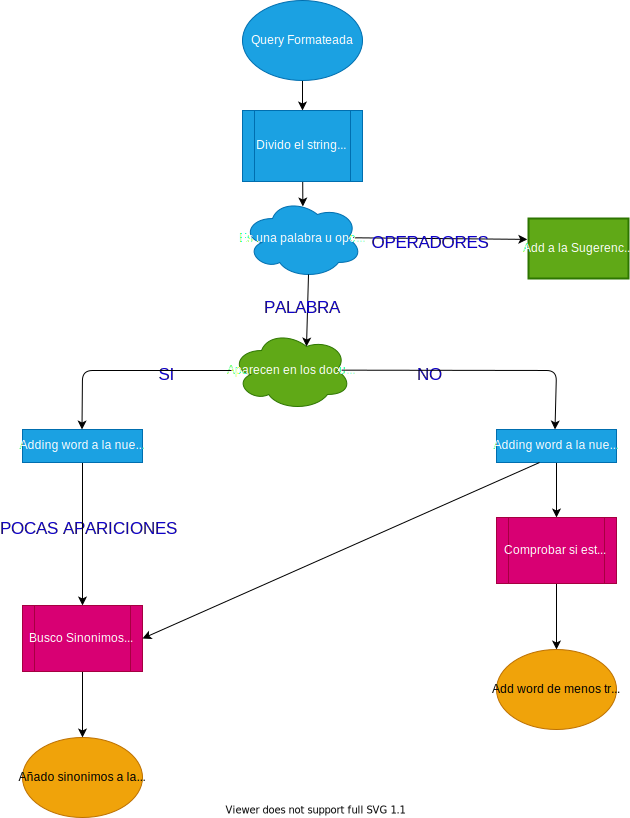

# Moogle!

## Documentación del Codigo Solución


> Proyecto de Programación I. Facultad de Matemática y Computación. Universidad de La Habana. Curso 2021.
>
>Dev: Carlos Manuel Gonzalez Peña C11

**Moogle!** es un buscador desarrollado con .Net Core 6.0 usando Blazor como Framework de interfás gráfica.
El obetivo de este buscador es poder realizar consultas de tipo texto en un conjunto de documentos.

## Aspectos de la aplicación

### Operadores

Cuando un usuario va a realizar una busqueda, este puede hacer uso de varios operadores par hacer que la busqueda sea más personalizada:

- **Operador de no existencia:** Un símbolo `!` delante de una palabra (e.j., `"algoritmos de búsqueda !ordenación"`) indica que esa palabra **no debe aparecer** en ningún documento que sea devuelto.
- **Operador de existencia:** Un símbolo `^` delante de una palabra (e.j., `"algoritmos de ^ordenación"`) indica que esa palabra **tiene que aparecer** en cualquier documento que sea devuelto.
- **Operador de cercanía:** Un símbolo `~` entre dos o más términos indica que esos términos deben **aparecer cerca**, o sea, que mientras más cercanos estén en el documento mayor será la relevancia. Por ejemplo, para la búsqueda `"algoritmos ~ ordenación"`, mientras más cerca están las palabras `"algoritmo"` y `"ordenación"`, más alto debe ser el `score` de ese documento.
- **Operador de relevancia:** Cualquier cantidad de símbolos `*` delante de un término indican que ese término es más importante, por lo que su influencia en el `score` debe ser mayor que la tendría normalmente (este efecto será acumulativo por cada `*`, por ejemplo `"algoritmos de **ordenación"` indica que la palabra `"ordenación"` tiene dos veces más prioridad que `"algoritmos"`).

#### Modelo Vectorial

Para realizar las consultas y mostrar los resultados, la aplicación usa el Modelo Vectorial. Si no sabes lo que es puedes dar [click aqui](./Report/Vectorial-Space-Model.md) y leer la explicación.

## Explicación General

La aplicacion esta dividida en dos grandes Componentes:

- `MoogleServer:` es un servidor web que renderiza la interfaz gráfica y sirve los resultados.
- `MoogleEngine:` contiene toda la logica que usa la aplicación para realizar las busquedas.

Durante el proyecto hago uso de un metodo llamado **Algoritmo de Porter** para poder llevar todas las palarbas a una raiz común y asi poder identificar a que familia pertenece, ayudando asi a encontrar resultados de la consulta del usuario. Tambien hago uso de un diccionario de sinonimos en formato JSON para poder devolver la mayor cantidad de resultados posibles en cada busqueda realizada.

### Implentación MoogleEngine

Este componente cuenta con 10 clases que contienten los algoritmos necesarios para realizar las consultas:

- [`SearchItems:`](#SearchItems) Contiene la información de la busqueda de un documento que va a ser renderizado.
- [`SearchResult:`](#SearchResult) Contiene una lista de `SearchItems` y una sugerencia de consulta para mostrar en los resultados.
- [`Moogle:`](#Moogle) En ella aparece un metodo Query, la cual tendra todo el proceso(apoyandose de las demas clases) desde que se recibe la query hasta que se mandan los resultados para renderizarlos.
- [`SaveData:`](#SaveData) Es una clase en la que se guardarán todos los datos extraídos de los documentos, o los datos que son necesarios para realizar las consultas.
- [`WordInfo:`](#WordInfo) Es una clase que guarda la información de cada palabra del documento, dígase las apariciones de la palbra en un determinado documento y el peso(score) de la palabra proporcionado por el **TF-IDF**.
- [`FilesMethods:`](#FilesMethods) Conjunto de metodos relacionados con el procesamiento de los documentos.
- [`AuxiliarMethods:`](#AuxiliarMethods) Conjunto de metodos auxiliares que tienen un uso global y que no tienen una clasificación especifica entre las demas clases.
- [`WorkingOperators:`](#WorkingOperators) Conjunto de Metodos para el procesamiento de los operadores que aparezcan en la consulta del usuario.
-[`WorkingSynonyms:`](#WorkingSynonyms) Clase dedicada al procesamiento de una base de datos de sinónimos en formato JSON de las palabras en español.
-[`PorterAlogrithm:`](#PorterAlogrithm) Clase con el Stemmer para calcular las raices de las palarbas del español.

Par favor, recomiendo que lea la explicación general del proyecto y luego de [click aqui](./Report/Clases.md) y lea la explicación de cada uno de los métodos de las clases, y luego vuelva a leer la explicación general del proyecto para una mayor comprención.

#### Procesamiento de Palabras del Corpus

Al arrancar el servidor se ejecuta el metodo `DataProcessing` el cual se encarga de leer todos los documentos y crea un diccionario `PosInDocs`.

```cs
Dictionary<int, Dictionaty<string, WordInfo>> PosInDocs;
```

En este diccionario, a cada documento le corresponde otro diccionario con el conjunto de palabras de ese documento en sus respectivas raices y por cada palabra una instancia de la clase `WordInfo` que contiene las apariciones de la palabra en el documento y el score de la misma. Cabe destacar que lo que veraderamente se guarda son las raices de cada palabra(usando el algoritmo de Porter), para asi poder hacer busquedas mas "generalizadas" y obtener mayores resultados.
Para calcular la relevancia de las palabras en sus respectivos documentos se usa el metodo `TF-IDF` que contiene la clase `WordInfo`.
Tambien se carga la base de datos de sinónimos a la clase `WorkingSynonyms`.

#### Procesamiento de la Query

Una vez que el usuario realiza una consulta se ejecuta el metodo `Query` de la clase `Moogle`. Este metodo contiene todo el flujo que se sigue hasta enviar los resultados al server.
Lo primero que se hace es llamar al metodo `FormatQuery` de la clase `AuxiliarMethods`, el cual me **"formatea"** la query para que en su uso próximo sea fácil de extraer las palabras y operadores con solo dividir la query entre espacios en blanco; ademas de que mediante el metodo `ValidOperators`, si un conjuno de operadores esta mal escrito o no tiene sentido o tienes cosas de mas el te devuelve uno que "intenta" deducir lo que quisistes decir. De esta forma, si el usuario escribe `"Todos los !*ALGoritmos de ordenación~existentes"`, al formatear la query obtendré `"todos los ! algoritmos de ordenacion ~ existentes"`, siendo de esta manera mas facil de trabajar.
Despues Se llama al metodo `GetNewQueryAndSuggestion` de la clase `Moogle`, el cual retorna dos elementos, uno es la nueva query y la otra la sugerencia. La nueva query no es mas que la misma que introdujo el usuario, pero en caso de que una palabra aparezca muy poco, o en caso de que no aparezca, pero algun sinonimo si, algunos sinonimos con la mayor cantidad de apariciones entre todos los documentos seran anadidos a la nueva query para que tambien sean buscados. En caso de que la palabra no se encuentra y tampoco existan sinonimos, es muy probable que este mal escrita. Usando el algoritmo de Levenshtein calculamos la cantidad de transformaciones que hay que hacerle a la palabra para transformarla en otra. Usando este algoritmo entre la palabra que no aparece y las palabras originales de los documentos, nos quedamos con las que menos transformaciones necesite(sin sobrepasar un maximo definido por nosotros), y la agregamos a la sugerencia.
En caso de que la query original sea lo suficientemente buena, no existira sugerencia.

A continuación un pequeño diagrama simulando el proceso explicado anteriormente.



Durante el proceso anterior, todos esos sinonimos que fueron añadidos, se les disminuirá el score, ya que son palabras importantes pero no las introdujo el propio usuario.

El siguiente paso es crear un diccionario con las palabras de la query correspondiéndole una Tuple de numeros.

 ```cs
Dictionarystring, Tupleint, float>> FreqAndWeigthWordsQuery;
 ```

En este diccionario, mediante el metodo `GetFreqWordsInQuery()` se guardara cada palabra de la query con la frecuencia de la misma en la query, y posteriormente, usaremos el metodo `UpdateFreqForOperatorRelevance()` para actualizar la frecuencia a las palabra que el operador de relevancia afecta(en caso de que el usuario halla introducido operadores en la query).
Luego con el método `GetWeigthOfQuery()` se calcula el peso de las palabras de la query usando la fórmula del `TF-IDF`, y después se le disminuye el peso a las palabras de la query que son sinónimos añadidos en el método que devuelve la query y la sugerencia.

Luego creamos el array sim, el cual mediante el metodo `GetSimBetweenQueryDocs()` se calcula, usando la distancia coseno entre dos vectores que tan igual es la query con todos los documentos.
En este array se guardan dos valores, la similitud de la query con el documento i-esimo, y i, correspondiente al id del documento i-esimo.
Hasta ahora tenemos la lista de los documentos con su similitud con la query. Ahora nos toca procesar los operadores introducidos por el usuario.

#### Procesamiento de los operadores

Aqui haremos uso de la clase `WorkingOperators` que contiene un conjunto de metodos para trabajar con los operadores.
La idea es crear una lista de pares, donde el primer elemento del par son los operadores que les corresponden a una plabra, cuya palabra sera guardada en el segundo elemento del par. En caso de que sea el operador de cercania lo que se hace es guardar el conjunto de palabra que este afecte similtaneamente. Por ejemplo, para la query `la *^ mayoria ~ somos ~ felices ! aqui`, se devolverán dos pares: `("~", "*^mayoria somos felices")` y `("!", "aqui")`. Esto se realiza usando el metodo `GetOperators()` de la clase `WorkingOperators`.

Mientras separamos los operadores con sus respectivas palabras, hacemos uso de un metodo de `WorkingOperators` llamado `ValidOperators`, que como su nombre lo indica es para validar un conjunto de operadores, porque puede ser que esten mal escritos y no tengan lógica alguna, para lo cuál el método se encargará de darle alguna lógica.
Luego usando un metodo llamado `ChangesOperators()` lo que se hace es aplicar los cambios de cada operador a los documentos.

Después de aplicar los respectivos cambios a los documentos, se pasa a ordenar los documentos en orden no-creciente para poder renderizarlos.
Por ultimo se pasa a construir un resultado, esto se hace con el metodo `BuildResult`. Básicamente lo que hacemos es crear una lista de `SearchItems`, en donde cada `SearchItems` tiene 4 elementos: El titlulo del documento, un snippet, el socre y las palabras que no aparecen en el documento. Para el snippet, que no es mas que una porción del documento que será mostrado, lo que se hace es, apoyandonos del metodo para calcular la cercania entre las palabras, tomar esas posiciones donde aparecen mas cerca y escoger un snippet de diámetro definido por nosotros que abarque lo mas posible todas esas apariciones de las palabras.

Ya por último se envía ese arreglo al server para que sea renderizado.

## BIBLIOGRAFIA

- **Modelo espacio vectorial:** https://docs.google.com/presentation/d/1iX-R1hhP_jCp0AyitrNf-Dp8-rAbcx6-/edit?usp=sharing&ouid=114373319558566279595&rtpof=true&sd=true
- **Algoritmo de Porter:** http://snowball.tartarus.org/algorithms/spanish/stemmer.html
- **Algoritmo de Levenshtein:** https://en.wikipedia.org/wiki/Levenshtein_distance
