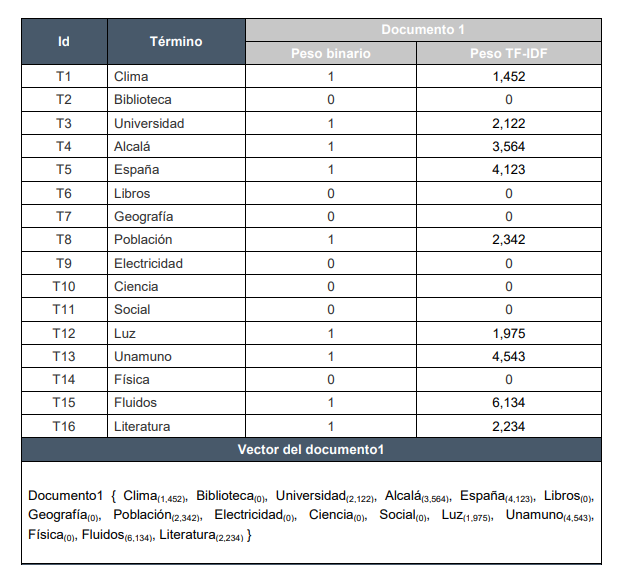
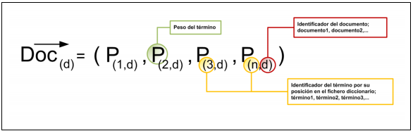
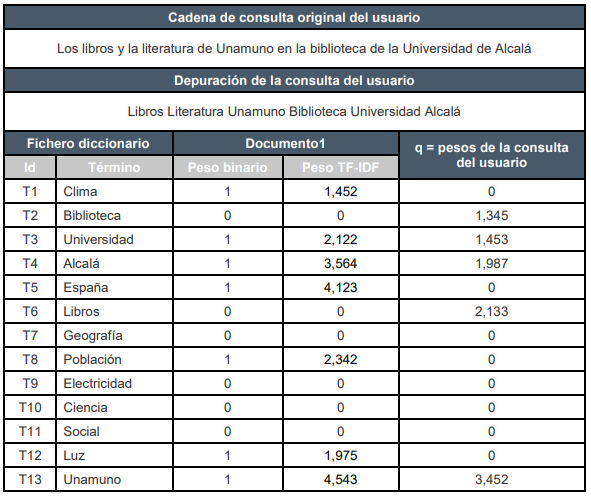
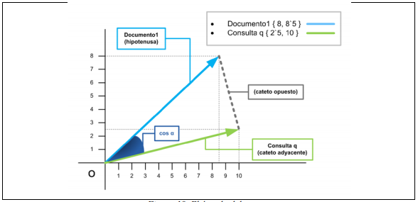
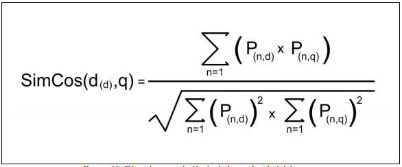

# Modelo Vectorial

El Modelo Vectorial es para calcular numéricamente que tan similares son dos documentos, apoyandose del metodo TF-IDF para calcular la relevancia de una palabra en un documento.
Este modelo se basa en tres principios:

- La capacidad del sistema de poder ordenar los resultados de una busqueda basado en el grado de similitud entre cada documento.
- Ponderar los terminos del documento(peso o score como también se conoce), no limitandose a la existencia o no del mismo(Modelo Booleano), sino que refleja la importancia de cada palabra a traves de un numero real.
- La ponderacion de las palabras de la consulta, asi el usuario puede a traves de operadores modifcar la relevancia del mismo y personalizar la busqueda.

Para calcular el peso de la palabra en cada documento se usa la formula del TF-IDF(explicación mas abajo), de esta forma un documento luciría asi:

Y la representación del vector documento quedaría así:

 Después de esto tenemos que ponderar la query del usuario como si fuese un dsocumeto mas, ya que esto es importantísimo para poder calcular la similitud entre el documento query y los documentos de la colección.

 

## Calculo de la similitud entre Documentos

En nuestra aplicación usamos la función coseno para medir la similitud. Esta ecuación nos da el valor del angulo formado entre el vector de un documento y el vector de la query. Este angulo nos indica que tan iguales son los documentos evaluados, de hecho, mientras mas pequeño sea el angulo mas similares son, ya que cos(0) = 1 y si son totalmente difetentes seria cero, ya que |cos(ang)| <= 1.

Y la formula para calcular la similitud entre los dos vectores sería esta:

## Ponderando documentos con el TF-IDF

El TF-IDF(Term Frequency / Inverse Document Frequency) es un un esquema de pesos para expresar el peso relativo de un termino **w** en el vector documento **d** y se calcula de la siguiente forma:

**tfidf(w, d) = tf(w, d) * idf(w)**,

donde **tf(Term Frequency)** es la cantidad de ocurrencias de la palabra **w** en un documento **d**, y el **idf(Inverse document Frequency)** es la cantidad de documentos (cantidad de documentos donde aparece la palabra w pero de forma inversa, debido a que se le otorga mayor peso a las palabras que ocurren en una menor cantidad de documentos).

El **idf(w)** se caclcula como :

**idf(w) = log(N / df(w))**,

donde **df(w)**  es la frecuencia de documento (cantidad de documentos que contienen la palabra w) y N representa la cantidad total de documentos en el corpus.